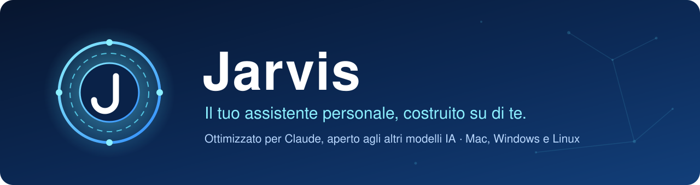
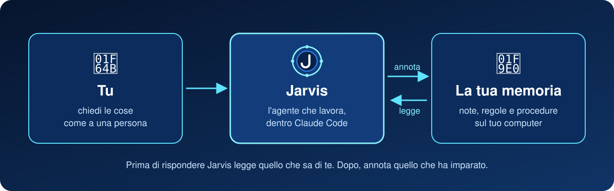

  

  
  
  
  
  

> **Jarvis è un assistente personale che si costruisce su di te.**
> Appena installato non sa niente di nessuno: alla prima conversazione ti chiede chi sei, di cosa ti occupi e cosa ti serve, e da lì diventa tuo. Non è l'assistente di un'altra persona copiato sul tuo computer.

---

## ✨ Cos'è

|  |  |
|---|---|
| 🧠 **Una memoria tua** | Tutto quello che Jarvis sa di te sta in note di testo normali, sul tuo computer, che leggi e modifichi con Obsidian. |
| 🤖 **Un agente che la usa** | Prima di risponderti legge quello che sa di te, dopo annota quello che ha imparato. Più lo usi, più ti conosce. |
| 🧩 **Procedure pronte** | Partono da sole quando chiedi le cose a parole: trasformare un articolo o un PDF in conoscenza, rispondere dalle tue note citandole, fare ricerche sul web con fonti verificate, far funzionare una cosa provando, rileggere il codice, prendere una decisione, fare il punto della settimana, salvare il lavoro. |
| 🔒 **Privato** | Le tue note restano sul tuo computer. Niente va online se non sei tu a chiederlo. |
| 🌍 **Non legato a un modello** | È ottimizzato per **Claude**, ma le istruzioni sono anche nel formato comune `AGENTS.md`, che leggono Codex, Cursor, OpenCode e molti altri: si può usare con la maggior parte dei modelli IA. |

  

---

## 🧰 Cosa serve

| | Cosa | Dove |
|---|---|---|
| 1 | Un abbonamento **Claude** (Pro o superiore) | [claude.ai](https://claude.ai) |
| 2 | **Obsidian**, gratuito, per leggere le note | [obsidian.md](https://obsidian.md) |
| 3 | **VS Code**, gratuito, con l'estensione **Claude Code** | [code.visualstudio.com](https://code.visualstudio.com) |

Git e Python servono anche loro, ma non devi pensarci: se mancano li installa il programma di installazione.

---

## 🚀 Installazione in 3 passi

### 1. Scarica

In questa pagina premi il pulsante verde **Code**, poi **Download ZIP**, ed estrai lo ZIP.

### 2. Apri il file per il tuo computer

| Computer | Cosa fare |
|---|---|
| 🍎 **Mac** | Clic destro su **`Installa Jarvis - Mac.command`**, poi **Apri**. La prima volta il Mac chiede conferma perché il file viene da internet. |
| 🪟 **Windows** | Doppio clic su **`Installa Jarvis - Windows.bat`**. Se compare *"Windows ha protetto il PC"*, premi **Ulteriori informazioni**, poi **Esegui comunque**. Se mancano Git o Python li installa e ti chiede di riaprire il file. |
| 🐧 **Linux** | Apri un terminale nella cartella e scrivi `bash "Installa Jarvis - Linux.sh"`. Se mancano git o Python li installa, chiedendoti la password. |

Ti chiede come chiamare la cartella, il tuo nome e la tua email. Il resto lo fa da solo.

### 3. Presentati a Jarvis

1. Apri la cartella appena creata in **Obsidian** (*Apri cartella come vault*).
2. Aprila anche in **VS Code** e avvia **Claude Code**.
3. Alla domanda *"ti fidi di questa cartella?"* rispondi **sì**.
4. Scrivi **`/onboard`** e rispondi alle domande. Da qui in poi Jarvis è tuo.

---

## ❓ Domande frequenti

<b>Qualcun altro vede le mie note?</b>

No. Le note vivono sul tuo computer. Chi ti ha passato questo link non ha accesso a niente di quello che scrivi.

<b>Posso usarlo in un'altra lingua?</b>

Sì. Parte in italiano, ma durante `/onboard` Jarvis ti chiede in che lingua vuoi parlare.

<b>Posso usarlo con un modello diverso da Claude?</b>

Sì. È pensato e provato con Claude Code, che è l'unico a usare anche i controlli automatici, come quello che chiede conferma prima di un comando pericoloso. Gli altri strumenti che leggono `AGENTS.md`, come Codex, Cursor e OpenCode, trovano le stesse regole e le stesse procedure.

<b>Come si aggiorna?</b>

Scrivi a Jarvis *"aggiorna il sistema"*. Ti dice cosa è cambiato e aggiorna solo se rispondi di sì. Se qualcosa non va, torna alla versione di prima.

<b>Ho sbagliato qualcosa, posso tornare indietro?</b>

Sì. Jarvis salva ogni passo importante: chiedigli di tornare a com'era prima.

---

## 🗂️ Com'è fatto dentro

| Cartella | A cosa serve |
|---|---|
| `Maps & Manuals` | Chi sei, cosa è attivo adesso, dove sta ogni cosa. Jarvis la legge per prima. |
| `Ideaverse` | I tuoi contenuti: progetti, note permanenti, fonti, lavori finiti, archivio. Parte vuota. |
| `Skills` | Le tue procedure personali. |
| `System` | Il motore: regole comuni, procedure, controlli. Si aggiorna senza toccare le tue note. |

Le tabelle riassuntive delle note si generano da sole a partire dalle informazioni in cima a ogni nota, e un controllo automatico blocca i salvataggi che romperebbero i collegamenti.

**Installazione a mano, passo per passo:** [SETUP.md](SETUP.md) per Mac e Linux, [SETUP-WINDOWS.md](SETUP-WINDOWS.md) per Windows.
**Cosa cambia in ogni versione:** [CHANGELOG.md](CHANGELOG.md).
